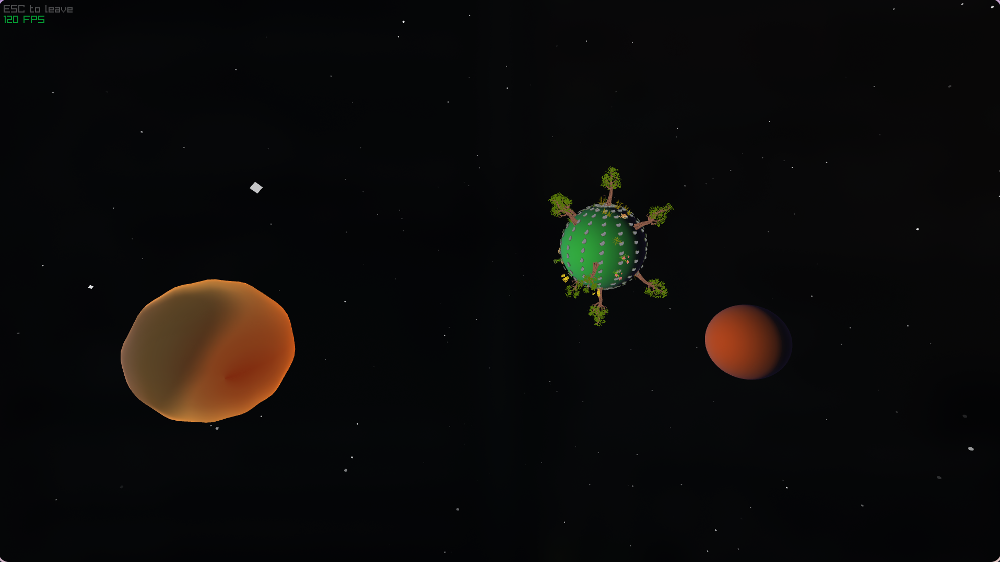

<h1 align="center">
  Zappy-GUI - EPITECH PROJECT 2025<br>
  
  <br>
</h1>

<div align="center">
  <p></p>
  <div align="center">
     <a href="https://github.com/pococo19/Zappy-GUI/stargazers">
        
     </a>
     <a href="https://github.com/pococo19/Zappy-GUI/">
        
     </a>
     <a href="https://github.com/pococo19/Zappy-GUI/blob/main/LICENSE">
        
     </a>
  </div>
  <br>
</div>

<p align="center">
  🎮 Zappy-GUI 🎮<br>
  A space-simulation GUI for the Zappy end of year project
</p>

---

## 📰 Description

> TODO



### Group leaders

> TODO

---

## 📦 Installation

Clone the repo with its submodules.

```bash
git clone --recurse-submodules -j$(nproc) git@github.com:Pococo19/Zappy-GUI.git
```

### Dependencies

Get the dependencies and build the project using `nix`:

```bash
nix develop
```

Or manually install them. We use `cmake` `bash` `python3`.<br>
All others dependencies are managed by **github submodules**.

### Build

Build the project using our multithreading build `bash` script:

```bash
./build.sh
```

Or manually run `cmake`:

```bash
mkdir build/ && cd build/
cmake .. -G "Unix Makefiles" -DCMAKE_BUILD_TYPE=Release
cmake --build .
cd ..
```

### Run and play!

```bash
./zappy_gui -p <server-port> -h <server-ip>
```

---

## 🖼️ Graphical backend

- Raylib (C bind in C++ by our engine)

---

## 🚀 Extra-Features

- Everything is GPU-rendered by [**our shaders**](../assets/shaders/)
- Every position in CPU-computed
- The program runs in `two threads`, one for the `network client` and the other for the `graphical engine`.

---

## 🛠️ Development

THANKS for developping with us ! See [**CODE OF CONDUCT**](./CODE_OF_CONDUCT.md) and [**CONTRIBUTING**](./CONTRIBUTING.md) for additional informations.

---

## Tested on

- MacOS
- Fedora
- Debian
- EndeavourOS
- Arch
- Ubuntu

---

## License

Project developed as part of the B-YEP-400 module at EPITECH.
See [**LICENSE**](/LICENSE).
